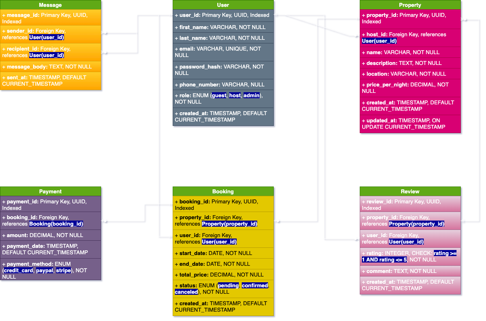

# 📝 Requirements Specification – Airbnb Clone Database

## 📌 Project Overview

This document outlines the database requirements for an Airbnb-like booking platform. The platform supports user roles (guests, hosts, admins), property listings, bookings, reviews, messaging, and payments.

---

## ⚙️ Functional Requirements

### 👤 User Management

* Users can register with their name, email, and password.
* Users can have roles: guest, host, or admin.
* Hosts can list properties.
* Guests can book properties and leave reviews.

### 🏡 Property Management

* Hosts can create, update, and delete property listings.
* Each property includes a name, description, location, and nightly price.

### 📅 Booking System

* Guests can book properties with start and end dates.
* The system calculates and stores the total price.
* Bookings have a status: pending, confirmed, or canceled.

### 💳 Payment Processing

* Payments are linked to bookings.
* Multiple payment methods supported: credit\_card, PayPal, Stripe.
* Payment amounts and timestamps are recorded.

### ⭐ Review System

* Guests can review properties they booked.
* Reviews include a rating (1–5) and a comment.

### 💬 Messaging

* Users can send messages to each other.
* Messages are timestamped and stored for future reference.

---

## 🧱 Database Schema Requirements

### 📌 Entities & Attributes

#### **User**

* `user_id`: UUID (PK)
* `first_name`, `last_name`: VARCHAR, NOT NULL
* `email`: VARCHAR, UNIQUE, NOT NULL
* `password_hash`: VARCHAR, NOT NULL
* `phone_number`: VARCHAR, NULL
* `role`: ENUM (guest, host, admin)
* `created_at`: TIMESTAMP, DEFAULT CURRENT\_TIMESTAMP

#### **Property**

* `property_id`: UUID (PK)
* `host_id`: FK → User(user\_id)
* `name`, `description`, `location`: TEXT/VARCHAR, NOT NULL
* `price_per_night`: DECIMAL, NOT NULL
* `created_at`: TIMESTAMP
* `updated_at`: TIMESTAMP, ON UPDATE CURRENT\_TIMESTAMP

#### **Booking**

* `booking_id`: UUID (PK)
* `property_id`: FK → Property(property\_id)
* `user_id`: FK → User(user\_id)
* `start_date`, `end_date`: DATE
* `total_price`: DECIMAL
* `status`: ENUM (pending, confirmed, canceled)
* `created_at`: TIMESTAMP

#### **Payment**

* `payment_id`: UUID (PK)
* `booking_id`: FK → Booking(booking\_id)
* `amount`: DECIMAL
* `payment_date`: TIMESTAMP
* `payment_method`: ENUM (credit\_card, paypal, stripe)

#### **Review**

* `review_id`: UUID (PK)
* `property_id`: FK → Property(property\_id)
* `user_id`: FK → User(user\_id)
* `rating`: INTEGER (1–5)
* `comment`: TEXT
* `created_at`: TIMESTAMP

#### **Message**

* `message_id`: UUID (PK)
* `sender_id`: FK → User(user\_id)
* `recipient_id`: FK → User(user\_id)
* `message_body`: TEXT
* `sent_at`: TIMESTAMP

---

## 🔒 Constraints

* Unique constraint on `email` in User.
* Non-null constraints on required fields.
* CHECK constraint on Review rating: 1 ≤ rating ≤ 5.
* FK constraints for all relational mappings.

---

## 📈 Indexing

* Indexed: All primary keys.
* Additional indexes:

  * `email` in User
  * `property_id` in Property, Booking
  * `booking_id` in Booking, Payment

---

## 📊 Entity-Relationship (ER) Diagram

